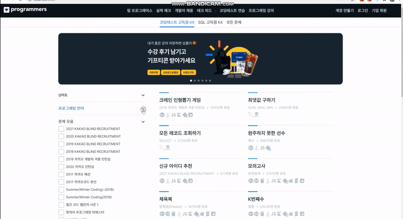
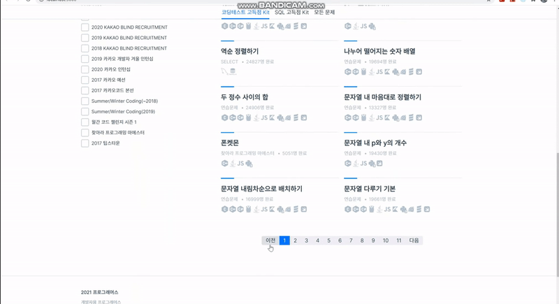
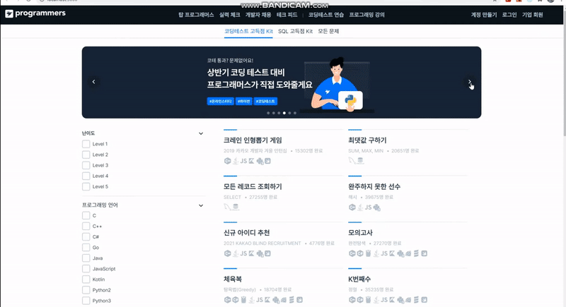

# 항해99 클론코딩

<p align='center'>
    
    
    
    
    
</p>

## 프로그래머스 클론코딩
해당 페이지를 클론했습니다.
https://programmers.co.kr/learn/challenges 

### :timer_clock: 개발기간
+ 2021년 04월 02일 ~ 2021년 04월 08일

### :mage: 맴버구성
+ :lipstick: Frontend - React
  + 정찬엽 (팀장)
     + 문제 난이도, 언어, 출처 필터 기능 개발
     
     + 문제 리스트 페이징 기능 개발 (모든 문제 가져온 후 프론트에서 작업)
     
     ```javascript
     // Reducer
    export default function reducer(state = initialState, action = {}) {
        switch (action.type) {
            case 'post/SET_POST':
                const set_list = action.page.slice(1, 21); // 첫 페이지의 20개
                return {original : action.page, list : set_list, total : action.page.length};
            case 'post/SET_PAGE_INDEX':
                let page_list = state.original.slice(action.start, action.end); // 페이지 마다 20개씩 잘라서 보여줌
                return {original : state.original, list : page_list, total : state.total, start : action.start, end : action.end};
            default:
                return state;
        }
    };
     ```
     + Carousel Slider 개발 (라이브러리 X)
     
     + Frontend DevOps 관리 (Git, AWS S3, Router 53)
  + 이지은
     + 상단 NavBar 및 하단 Footer 개발
     + 영상 제작
+ :computer: Backend - Spring
  + 박건열
  + 이승민
  + Source (해당 주소에서 확인 가능합니다.)
    + https://github.com/msmn1729/Programmers-clone

### :100: 배운점 + 느낀점
+ API 관리 및 Carousel, Pagination, Filter 기능 개발
  + https://kodepaper.tistory.com/20

### :clapper: 결과물
https://www.youtube.com/watch?v=Ejoa31jhNrc
